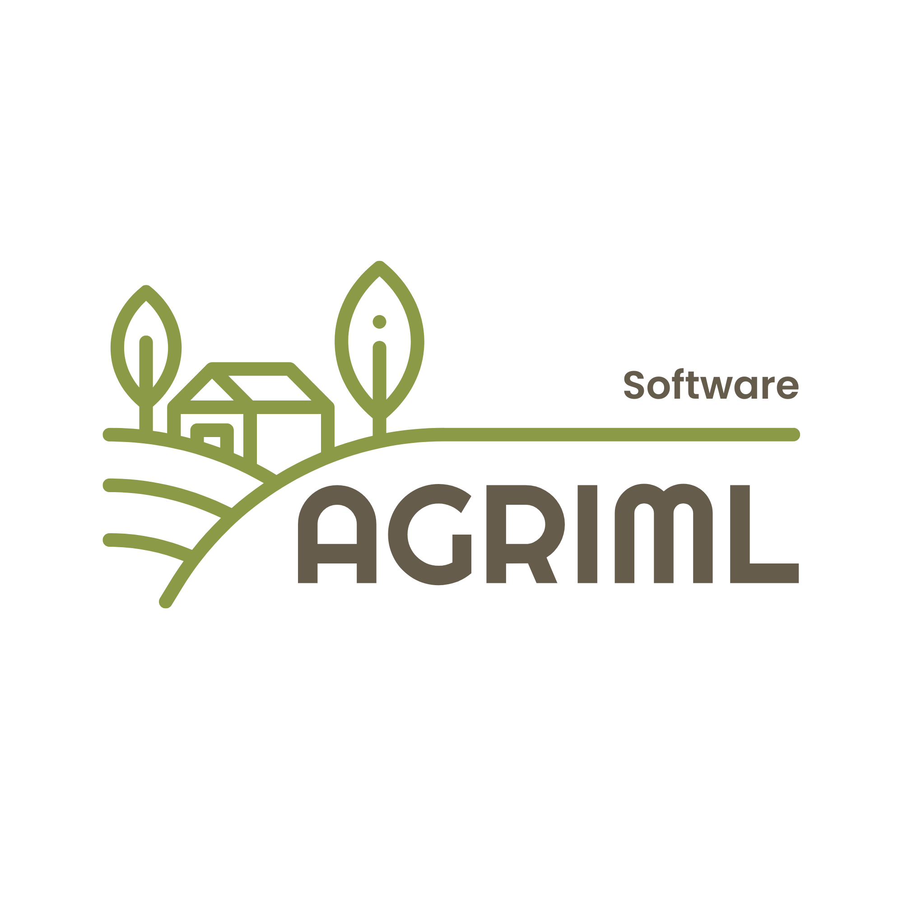

<h1 align="center">
   
  
   
  AgriML Software
   
</h1>

<h4 align="center">A tool designed to optimize resource utilization and enhance data analysis in agriculture.</h4>

  
  
  
  
    
    
    
    
    
    

## Context

[Hack4Earth Hackathon](https://hack4earth.netlify.app/)

> Hack4Earth is a dynamic hackathon dedicated to crafting innovative solutions for climate change and environmental sustainability.

> This event, held in conjunction with the 21st IEEE International Conference on AICCSA, brings together experts and enthusiasts to develop technologies and strategies aligned with the UN's Sustainable Development Goals (SDGs).

> from October 4 to 18, 2024, Participants will use open-source platforms and services to create tools that address sustainability issues. Whether it's optimizing agriculture, improving resource management, or enhancing environmental monitoring, Hack4Earth fosters innovations that contribute to a sustainable future.

- [IEEE AICCSA 2024](https://aiccsa.net/AICCSA2024/)

## Description

AgriML Software

An application for resource analysis and management in agriculture. For instance, it can monitor water usage and other essential resources through data from IoT devices. The application provides recommendations to optimize agricultural practices and offers predictions to improve farming outcomes without consuming too many resources.

### Main goal

- To optimize resource utilization and enhance data analysis in agriculture ;
- To provide recommendations to optimize agricultural practices and enhance farming outcomes ;
- Track resource consumption using IoT devices (water, etc.).

### Some pages

#### Onboarding
- Welcome screen with app logo and slogan.
- Brief introduction to the app's mission and goals.
- User registration with basic details or optional social media login.

#### Home Screen

- Main screen with navigation options.
- Navigation options:
  - Home
  - Activity
  - Recommendation
  - Profile
- Dashboard with graphs and charts.

#### Activity Screen

- List of activities and their details.
- Add new activity.
- Delete an activity.
- Edit an activity
- View an activity.

#### Recommendation Screen

- Recommendations for improvements in resource management.
- Recommendations for improvements in farming practices.
- Recommendations for improvements in environmental monitoring.

#### Profile
- Option to edit profile settings and preferences.

## Team members
| GitHub                                                 | Full name
| :----------------------------------------------------- | :-----------------------------------------
| @[Banitongwa7](https://github.com/Banitongwa7)         | David BANITONGWA
| @[jas21111](https://github.com/jas21111)               | Ben Taher YASMINE
| @[pasco1284](https://github.com/pasco1284)             | Louey SAADAOUI
| @[Aziiz1002](https://github.com/Aziiz1002)             | Aziz
| @[King6Lyon](https://github.com/King6Lyon)             | Mahamadou Awal Ahmad MOCTAR

